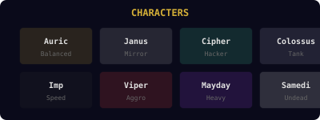
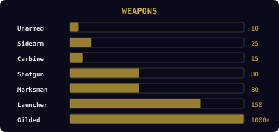
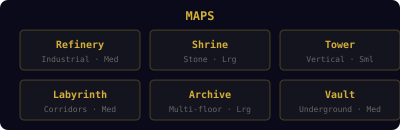
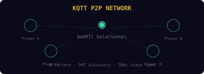

# 🔫 GOLDEN SHOWER 🔫
## Retro Arena FPS by Konomi Systems

```
   ╔═══════════════════════════════════════════════════════════╗
   ║  ██████╗  ██████╗ ██╗     ██████╗ ███████╗███╗   ██╗     ║
   ║ ██╔════╝ ██╔═══██╗██║     ██╔══██╗██╔════╝████╗  ██║     ║
   ║ ██║  ███╗██║   ██║██║     ██║  ██║█████╗  ██╔██╗ ██║     ║
   ║ ██║   ██║██║   ██║██║     ██║  ██║██╔══╝  ██║╚██╗██║     ║
   ║ ╚██████╔╝╚██████╔╝███████╗██████╔╝███████╗██║ ╚████║     ║
   ║  ╚═════╝  ╚═════╝ ╚══════╝╚═════╝ ╚══════╝╚═╝  ╚═══╝     ║
   ║           S H O W E R   //   K O N O M I                 ║
   ╚═══════════════════════════════════════════════════════════╝
```

[](https://github.com/teslasolar/goldenshower/actions)
[](https://github.com/teslasolar/goldenshower/issues)
[](https://github.com/teslasolar/goldenshower)
[](https://teslasolar.github.io/goldenshower)
[](https://github.com/teslasolar/goldenshower)

---

## 📊 Live Dashboard

> Auto-generated from GitHub API. Stars, issues, commits, label distribution — all live.


---

## 🎮 Characters



---

## 🔫 Weapons



---

## 🗺️ Maps



---

## 🌐 KQTT P2P Network



---

## 🏗️ Architecture

```
┌─────────────────────────────────────────────────────────────┐
│                    GOLDEN SHOWER STACK                      │
├─────────────────────────────────────────────────────────────┤
│  📄 MarkdownRunner    │ Parse docs → Execute code           │
│  ⚡ Engine            │ WebGL + Mat4/Vec3 + Input + Loop    │
│  🌐 KQTT Network     │ WebRTC P2P + StateSync + DHT        │
│  📦 Lobby             │ Host/Join + Settings + Ready        │
│  🔫 Game              │ Players + Weapons + Arena           │
│  🎵 Audio Fabric      │ Konomi audio-reactive visuals       │
│  📋 Tag DB            │ GitHub Issues → live game data      │
└─────────────────────────────────────────────────────────────┘

     GitHub Pages VM ◄──── WebRTC P2P ────► GitHub Pages VM
            │                                      │
            └──── GitHub Issues Tag DB ────────────┘
```

## 🚀 Play

### Browser (GitHub Pages — free forever)
```
https://teslasolar.github.io/goldenshower
```

### Local Dev
```bash
git clone https://github.com/teslasolar/goldenshower.git
cd goldenshower
npm start
# → open localhost:3000
```

### Tests
```bash
npm test          # 17 unit tests
npm run lint      # doc validation
```

## 📋 Tag DB (GitHub Issues = Live Game Data)

Every GitHub Issue with label `tag` is a **live database entry**. The game reads these at runtime.

### Add a weapon:
```
Title: weapon:plasma-rifle
Labels: tag, weapon
Body:
  dmg: 40
  rate: auto
  range: 800
  type: energy
  color: #44ffaa
```

### Add a map:
```
Title: map:rooftop
Labels: tag, map
Body:
  size: medium
  theme: urban
  spawns: 8
```

### Add a character:
```
Title: character:ghost
Labels: tag, character
Body:
  color: #888888
  trait: invisible-on-crouch
  hitbox: standard
  speed: 1.2
```

CI regenerates SVG badges on every push. Community mods = opening issues.

## 📄 Markdown Runner

The entire game lives in `docs/`. The `markdown-runner.js` engine:
1. Fetches `.md` files
2. Extracts fenced `js` code blocks
3. Executes them in dependency order
4. The game assembles itself from documentation

Change the docs → change the game. No build step.

## 🎵 Audio Fabric Integration

GOLDEN SHOWER inherits from the [Konomi](https://github.com/teslasolar/AudioFabric) audio-reactive engine:
- Ki blast charge system (voice-powered)
- Audio-reactive arena lighting
- Kotoba glyph effects on kills
- Vagal bass response on death

## 📦 Distribution

| Platform | Status | Price | Multiplayer |
|----------|--------|-------|-------------|
| **GitHub Pages** | ✅ Live | Free | KQTT P2P |
| **Steam** | 🔜 Soon | $4.99 | KQTT P2P |
| **itch.io** | 🔜 Planned | PWYW | KQTT P2P |

All platforms use the same KQTT P2P protocol — cross-play between browser and desktop.

---

**Konomi Systems** · GOLDEN SHOWER · No servers, no rules, no pants.

*SVGs auto-generated by `scripts/gen-svg.js` from GitHub API*
