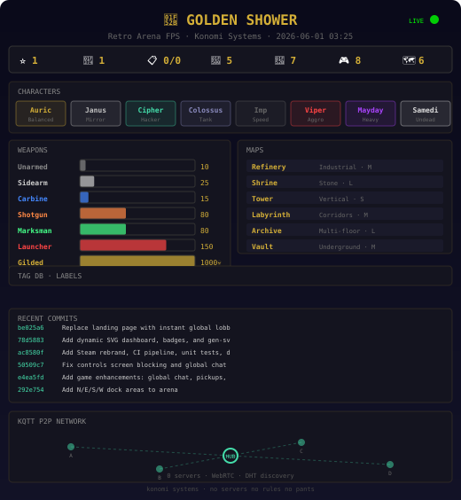

# 🔫 GOLDEN SHOWER

 [](https://github.com/teslasolar/goldenshower/actions) [](https://teslasolar.github.io/goldenshower)

**Retro Arena FPS · P2P · Zero Servers · Konomi Systems**



## Quick Start

```bash
# browser
https://teslasolar.github.io/goldenshower

# local
git clone https://github.com/teslasolar/goldenshower && cd goldenshower && npx serve .
```

`WASD` move · `Mouse` look · `Click` shoot · `Space` jump · `Enter` chat · `Tab` players

## Tag DB

Open a [GitHub Issue](https://github.com/teslasolar/goldenshower/issues) with label `tag` to add live game content:

```
weapon:plasma   → dmg:40 rate:auto range:800
map:rooftop     → size:medium theme:urban spawns:8
character:ghost → trait:invisible speed:1.2 hitbox:small
```

CI reads issues → regenerates dashboard SVG → game loads them at runtime.

## Architecture

```
📄 MarkdownRunner ──→ Parse docs → Execute code
⚡ Engine ──────────→ WebGL + Mat4 + Input + Loop
🌐 KQTT ───────────→ WebRTC P2P + DHT + StateSync
📋 Tag DB ─────────→ GitHub Issues → Live data
🎵 AudioFabric ────→ Ki blasts + audio-reactive fx
```

## Heartbeat API

```
GET badges/heartbeat.json  → { status, stars, forks, issues, commits, ts }
GET badges/heartbeat.svg   → animated pulse badge
GET badges/dashboard.svg   → full live dashboard
```

Auto-updated on every push by CI. The SVG has animated elements — the heartbeat pulses, network lines blink, the LIVE dot breathes.

## Distribution

| Platform | Status | Price |
|----------|--------|-------|
| GitHub Pages | ✅ Live | Free |
| Steam | 🔜 | $4.99 |

---

*Konomi Systems · no servers no rules no pants*
